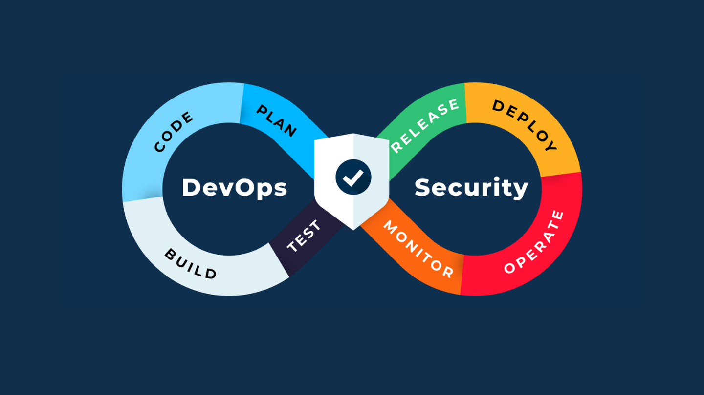
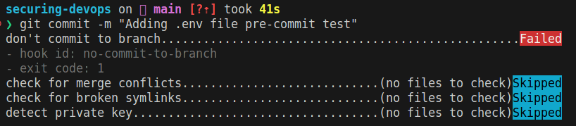
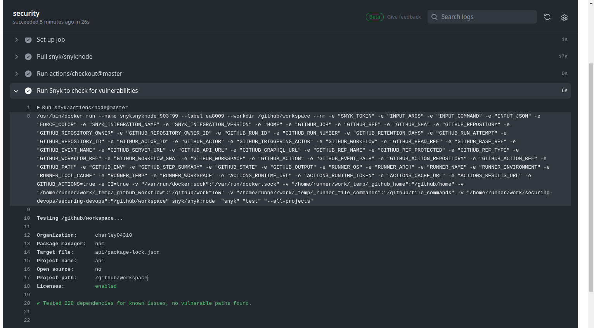
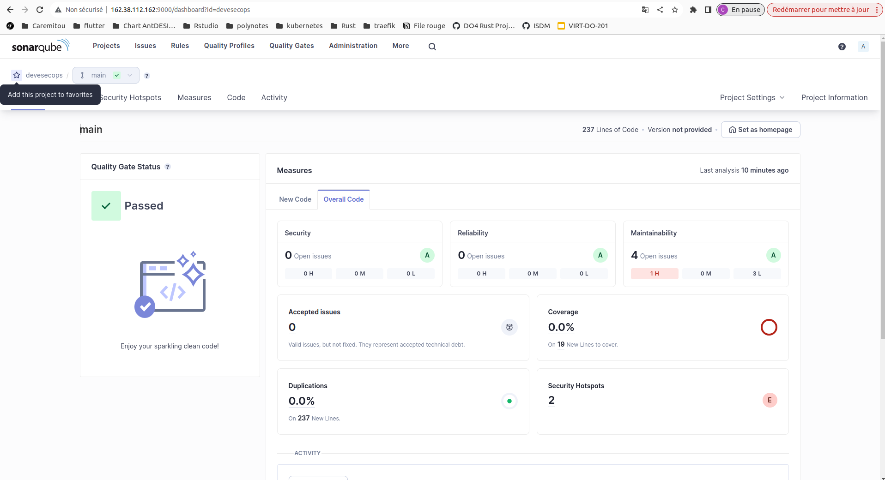

# Securing DevOps

- **Authors:** Charley GEOFFROY & Sylvain Pierrot
- **Année:** 2023/2024
- **Matière:** Securing DevOps
- **Supervised by:** M. Sureau Florian



This repository contains the source code for the polytech project "Securing DevOps".

- Define a subject, with existing code
- Setup repository(ies)
- Taking into consideration each step of security we discussed, create
  pipelines, analysis tools, reports… that apply best practices.
- Write a report demonstrating your understanding of DevSecOps practices

It must include:

- Explanation of each step
- Reason why you did these steps
- Your understanding of the results (security elements)

## Table of contents

- Developpers: project life cycle
- External dependencies

## Threat Schema : Where am I most vulnerable to attacks?


### Threat entities

**Actor**

- HTTP Client (HTTP Request and Response): Represents a user or system making requests and receiving responses over the HTTP protocol.
- MQTT Client (TCP Publication): Represents a IOT devices or system sending messages over the MQTT protocol using TCP.

**Exposed Service**

- Reverse Proxy: Acts as a gateway exposed to the internet, handling all incoming traffic and forwarding it to the appropriate services.

**Trusted Boundary (Local Network)**

- NestJS API: A Node.js-based API running on the local network, providing various functionalities.
- MQTT Broker: Manages the MQTT communication within the local network, handling message publications and subscriptions.
- PostgreSQL Database: A relational database used to store and retrieve data Securingly within the local network.

In this threat model, the HTTP and MQTT clients interact with the system through a reverse proxy, which serves as the entry point for all traffic.

### Threats list

**Threats to HTTP Client (HTTP Request and Response):**

- Cross-Site Scripting (XSS): Malicious scripts are injected into the HTTP request, which is then executed by the HTTP client's browser.

- SQL Injection: If the HTTP client interacts with the NestJS API in a way that involves database queries, an attacker might attempt to inject malicious SQL code.

**Threats to MQTT Client (TCP Publication):**

- Unauthorized Access: An attacker gains access to the MQTT broker by exploiting vulnerabilities in the MQTT client's connection.

- Denial of Service (DoS): An attacker overwhelms the MQTT broker with a high volume of TCP publications, causing it to become unresponsive.

- Spoofing: An unauthorized entity intercepts and monitors MQTT messages, potentially exposing sensitive information.

**Threats to Reverse Proxy (Exposed Service):**

- DDoS Attacks: The reverse proxy may be targeted with a Distributed Denial of Service attack, rendering it unable to handle legitimate traffic.

- Inadequate Authentication and Authorization: If not properly configured, the reverse proxy might allow unauthorized access to the internal services.

- Protocol-Based Attacks: An attacker exploits weaknesses in the protocols (HTTP, MQTT) handled by the reverse proxy.

## Securing developpers environment

### Github organization security

In addition to the CI pipeline, it's important to think about the overall security of the GitHub organization. So, we've put the following security measures in place:

- **Two-factor authentication (2FA):** 2FA is enabled for all developers, which adds an extra layer of security to their accounts.

- **Branch protection rules** : Branch protection rules are used to prevent direct commits to the main branch and enforce code reviews before merging. This helps to ensure that all changes to the main branch are reviewed and approved by other team members.

- **Require pull request reviews before merging:** This setting ensures that all pull requests are reviewed before they can be merged into the main branch. This helps to catch potential security vulnerabilities and other issues before they are introduced into the codebase.

- **Require status checks to pass before merging:** This setting ensures that all required status checks (e.g., CI/CD pipelines, code quality checks) must pass before a pull request can be merged. This helps to ensure that the code being merged meets the necessary quality and security standards.

### Github pre-commit hooks

Before even talking about CI, the first step is to ensure that the source code is clean and follows coding conventions. When onboarding a new team member, it's crucial to make sure their development environment is set up identically to other team members. This process cannot be automated or versioned, and must be done independently for each developer. To achieve this, we use the tool [pre-commit](https://pre-commit.com/hooks.html) which allows triggering hooks before each commit. In our case, we use [the following hooks](./.pre-commit-config.yaml):

- no-commit-to-branch
- check-merge-conflict
- check-symlinks
- detect-private-key

We chose these hooks to prevent human errors and sensitive data leaks. For example, the `detect-private-key` hook detects private keys that might be accidentally committed. Additionally, the `no-commit-to-branch` hook ensures commits aren't made directly to the main branch, forcing the use of pull requests. Lastly, the `check-merge-conflict` hook detects merge conflicts before committing.

An example of the `no-commit-to-branch` hook:



We could further enhance security by integrating custom hooks to check for the presence of environment files. Edit the `.git/hooks/pre-commit` file to add the following hooks:

```bash
#!/bin/sh
# Find .env files in the staged changes
ENV_FILES=$(git diff --cached --name-only --diff-filter=AM | grep '\.env$')

if [ -n "$ENV_FILES" ]; then
  echo "Error: Committing .env files is not allowed."
  echo "The following .env files were found in your changes:"
  echo "$ENV_FILES"
  exit 1
fi

exit 0
```

## Pipeline and Dockerfile security

### Continuous Integration (CI)

In this section, we will discuss the security choices of CI pipeline, the advantages of using Snyk and sonarqube, and how it addresses the core security concerns in our Continuous Integration (CI) workflows.

### Security Choices

Our CI workflows was thinked to ensure the quality and security of our codebase by performing : syntax checks, testing, and security analysis of both dependencies and Dockerfiles. By [integrating these security](./.github/workflows/) measures into our development process, we aim to create a reliable and robust application.

#### Advantages of Snyk


Snyk is a powerful tool for identifying and fixing vulnerabilities in open-source dependencies. It offers several benefits that make it an ideal choice for our project:

1. Easy Integration: Snyk can be easily integrated into our CI/CD pipelines, allowing us to automatically test for vulnerabilities whenever changes are made to the codebase.
2. Comprehensive Vulnerability Database: Snyk maintains an extensive database of known vulnerabilities, which is continuously updated. This ensures that our application is protected against the latest security threats.
3. Language Support: Snyk supports a wide range of programming languages and package managers, making it a versatile tool for various projects.

#### Security Concerns

By incorporating Snyk into our CI workflows, we address several core security concerns:

1. Dependency Vulnerabilities: Snyk scans our project's dependencies and identifies any known vulnerabilities. This helps us ensure that our application is built on a secure foundation.

2. Proactive Security: By continuously monitoring and testing our codebase for vulnerabilities, we adopt a proactive approach to security. This allows us to identify and fix issues before they can be exploited.

3. DevSecOps Integration: Integrating Snyk into our CI/CD pipelines promotes a DevSecOps culture, where security is an integral part of the development process. This results in a more secure and reliable application.

### Advantages of SonarQube


SonarQube is a popular open-source platform for continuous inspection of code quality and security. It performs static code analysis to detect bugs, code smells, and security vulnerabilities. By integrating SonarQube into our CI/CD pipeline, we can automatically analyze our codebase and identify potential issues.


### Complementing Snyk with SonarQube

While Snyk focuses on identifying and fixing vulnerabilities in open-source dependencies, SonarQube specializes in static code analysis. This makes the two tools complementary, as they address different aspects of application security.

1. Dependency Vulnerabilities (Snyk): Snyk scans our project's dependencies and identifies known vulnerabilities, ensuring that our application is built on a secure foundation.

2. Static Code Analysis (SonarQube): SonarQube analyzes our codebase for bugs, code smells, and security vulnerabilities, helping us maintain high code quality and adhere to best practices.

In summary, the integration of both Snyk and SonarQube into our security workflow provides a comprehensive solution to address a wide range of security concerns. Snyk, with its easy integration, extensive vulnerability database, prioritized remediation, and broad language support, excels at identifying and fixing vulnerabilities in open-source dependencies. SonarQube, on the other hand, offers static code analysis, helping us maintain high code quality and adhere to best practices.


### Dockerfile review

Our [dockerfile](./api/Dockerfile) is designed to be as secure as possible. First of all, we use the `node:18-alpine` image as a base image, which is a minimal and secure version of the Node.js runtime. We also use multi-stage builds to reduce the size of the final image and minimize the attack surface. Moreover, we define a non-root user `node`to run the application, which helps to mitigate the risk of privilege escalation attacks.

## Reverse Proxy security

### Encryption and TLS/SSL

In our specific setup, we will use Traefik to manage encryption and TLS/SSL configuration for our MQTT server. This approach ensures secure communication between MQTT clients and the broker by encrypting data in transit.

By configuring [Traefik to manage encryption](./traefik/traefik.yaml) and TLS/SSL for our MQTT server, we ensure secure communication between MQTT clients and the broker, mitigating threats such as spoofing and unauthorized access. This personalized approach allows us to maintain a secure and reliable MQTT environment tailored to our specific needs.

### Rate limiting

Traefik provides a [rate limiting](./traefik/dynamic_conf.yaml) feature that can be used to protect against abuse and DoS attacks. Rate limiting can be applied to the entire reverse proxy or to specific services.

## Securing MQTT broker

### Access Control List (ACL) and TLS/SSL

There is a risk of unauthorized access to the MQTT broker, which could lead to data breaches and other security issues. To mitigate this risk, [Access Control Lists](./mosquitto/config/acl.conf) are used to define the permissions (read/write) for different clients and topics. This helps to ensure that only authorized clients can publish and subscribe to specific topics.

Additionally, using Securing communication channels and certificate-based authentication can further enhance the security of the MQTT broker. By [enabling TLS/SSL](./mosquitto/config/mosquitto.conf) encryption, the data transmitted between the clients and the broker is protected from eavesdropping and manipulation. Moreover, using certificates for client authentication ensures that only trusted clients can connect to the broker, adding an extra layer of security. This combination of access control lists, Securing communication, and certificate-based authentication helps to create a robust security posture for the MQTT broker, protecting it from unauthorized access and potential security threats.

## Securing NestJS API

### Using typeORM as ORM

[TypeORM](https://typeorm.io/#/) uses prepared statements to execute SQL queries, which helps to prevent SQL injection attacks. Prepared statements separate the SQL query from the user input, which prevents the user input from being interpreted as part of the SQL query. TypeORM is also used to define the database schema and relationships, which helps to prevent misconfigurations and vulnerabilities.

### Securing Data Transfer Objects (DTOs)

Data transfer object (DTO) validation is performed using `class-validator` and `class-transformer` from [nestJS](https://docs.nestjs.com/techniques/validation)
framework. This ensures that the data received by the API is validated and transformed according to the defined rules. This helps to prevent malformed or malicious data from being processed by the API (Cross-Site Scripting).

In the given example, the `HelloDto` class is utilized for validating "email" and "name" fields, which also implements the `HelloEntity` interface (representing the database entity). The `@IsString` and `@IsNotEmpty` decorators are employed to enforce validation rules. The `@IsEmpty` decorator is used to prevent the "id" field from being set by the client, as it is generated by the server.

```typescript
export class HelloDto implements HelloEntity {
  @IsEmpty()
  readonly id: UUID;

  @IsString()
  @IsNotEmpty()
  readonly name: string;
}
```
