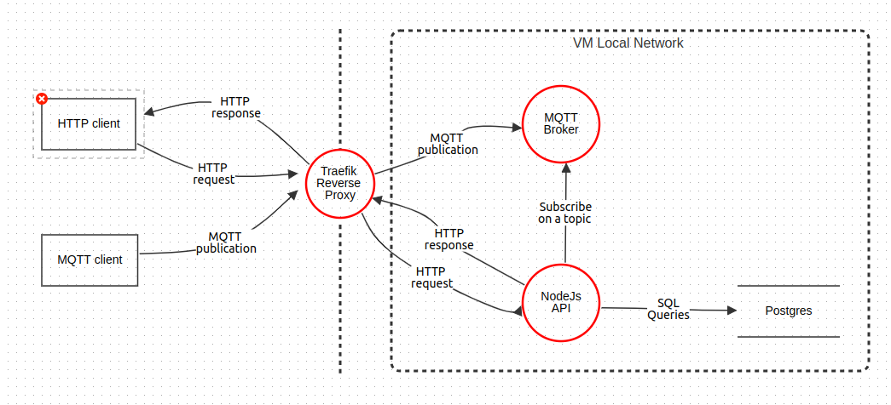

# Securing DevOps

**Authors:** Charley GEOFFROY & Sylvain Pierrot
**Année:** 2023/2024
**Matière:** Securing DevOps
**Supervised by:** M. Sureau Florian

This repository contains the source code for the polytech project "Securing DevOps".

- Define a subject, with existing code
- Setup repository(ies)
- Taking into consideration each step of security we discussed, create
  pipelines, analysis tools, reports… that apply best practices.
- Write a report demonstrating your understanding of DevSecOps practices

It must include:

- Explanation of each step
- Reason why you did these steps
- Your understanding of the results (security elements)

## Threat Schema : Where am I most vulnerable to attacks?

### Threat entities

**Actor**

- HTTP Client (HTTP Request and Response): Represents a user or system making requests and receiving responses over the HTTP protocol.
- MQTT Client (TCP Publication): Represents a IOT devices or system sending messages over the MQTT protocol using TCP.

**Exposed Service**

- Reverse Proxy: Acts as a gateway exposed to the internet, handling all incoming traffic and forwarding it to the appropriate services.

**Trusted Boundary (Local Network)**

- NestJS API: A Node.js-based API running on the local network, providing various functionalities.
- MQTT Broker: Manages the MQTT communication within the local network, handling message publications and subscriptions.
- PostgreSQL Database: A relational database used to store and retrieve data securely within the local network.

In this threat model, the HTTP and MQTT clients interact with the system through a reverse proxy, which serves as the entry point for all traffic.

## Threats list

**Threats to HTTP Client (HTTP Request and Response):**

- Cross-Site Scripting (XSS): Malicious scripts are injected into the HTTP request, which is then executed by the HTTP client's browser.

- SQL Injection: If the HTTP client interacts with the NestJS API in a way that involves database queries, an attacker might attempt to inject malicious SQL code.

**Threats to MQTT Client (TCP Publication):**

- Unauthorized Access: An attacker gains access to the MQTT broker by exploiting vulnerabilities in the MQTT client's connection.

- Denial of Service (DoS): An attacker overwhelms the MQTT broker with a high volume of TCP publications, causing it to become unresponsive.

- Clandestine eavesdropping: An unauthorized entity intercepts and monitors MQTT messages, potentially exposing sensitive information.

**Threats to Reverse Proxy (Exposed Service):**

- DDoS Attacks: The reverse proxy may be targeted with a Distributed Denial of Service attack, rendering it unable to handle legitimate traffic.

- Inadequate Authentication and Authorization: If not properly configured, the reverse proxy might allow unauthorized access to the internal services.

- Protocol-Based Attacks: An attacker exploits weaknesses in the protocols (HTTP, MQTT) handled by the reverse proxy.

## Securing CI pipeline

### Continuous Integration (CI)

- **Snyk:** Snyk is used to scan the application for vulnerabilities in the dependencies and Docker images. Snyk also pushing the results to the GitHub repository available in the Security tab.

- ESLint: ESLint is used to enforce code quality and best practices in the application's source code.

### Dockerfile security

- Container is running as non-root user
- Container is running with minimal privileges
- Container is running with ressource limits
- Container is running with minimal system calls

### Github pre-commit hooks

- **Husky:** Husky is used to run pre-commit hooks that enforce code quality and best practices before a commit is made.
- **Lint-staged:** Lint-staged is used to run ESLint on the staged files before a commit is made.

## API Security

#### DTO Validation

Data transfer object (DTO) validation is performed using class-validator and class-transformer. This ensures that the data received by the API is validated and transformed according to the defined rules.
